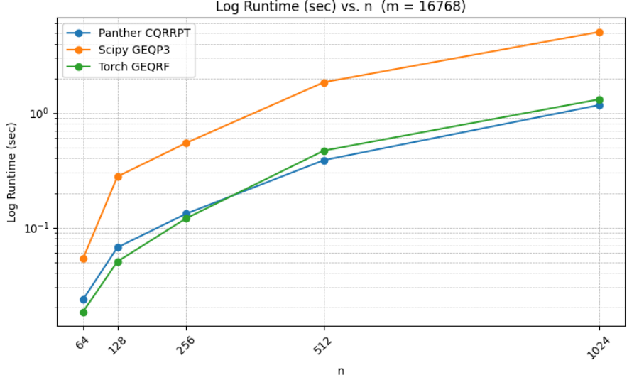
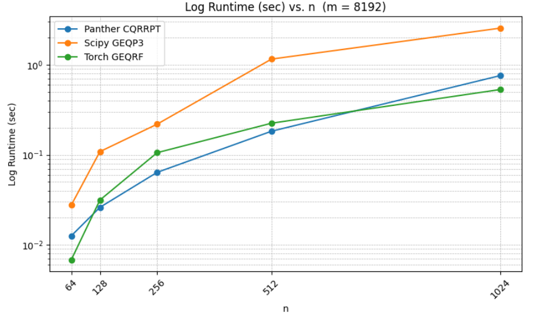
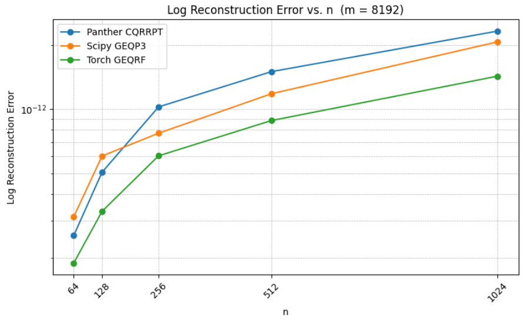
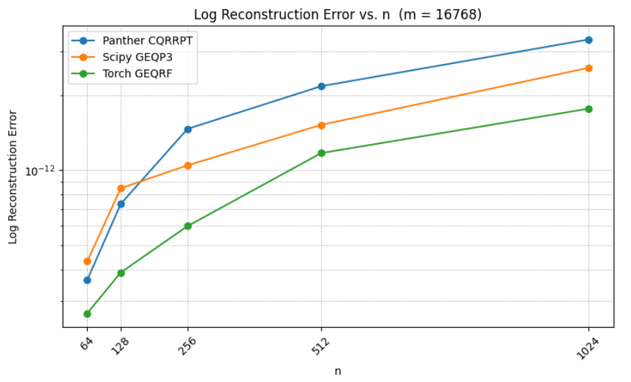
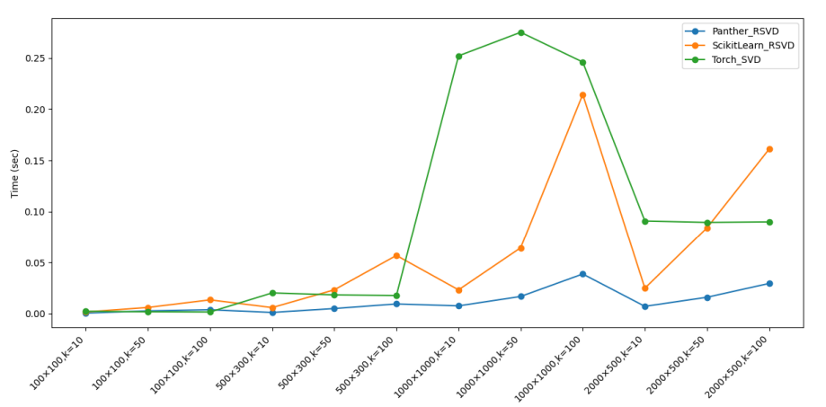
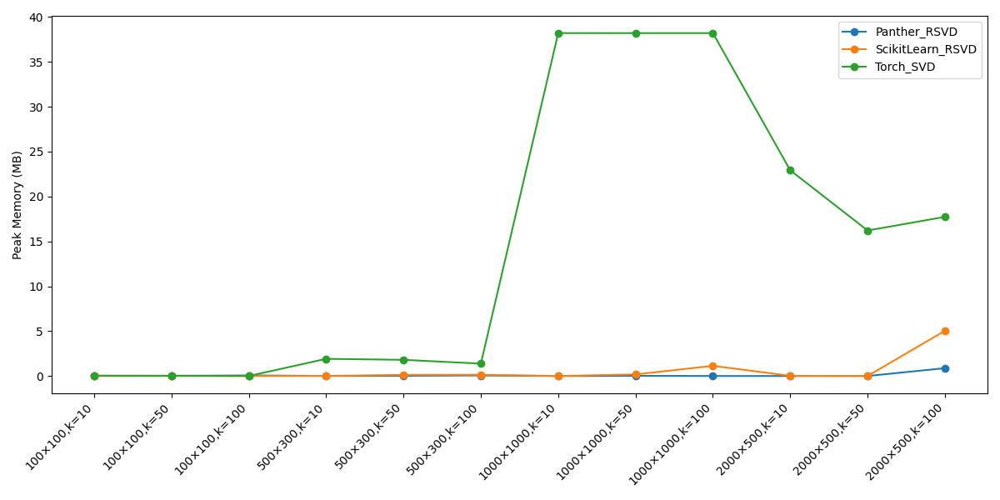
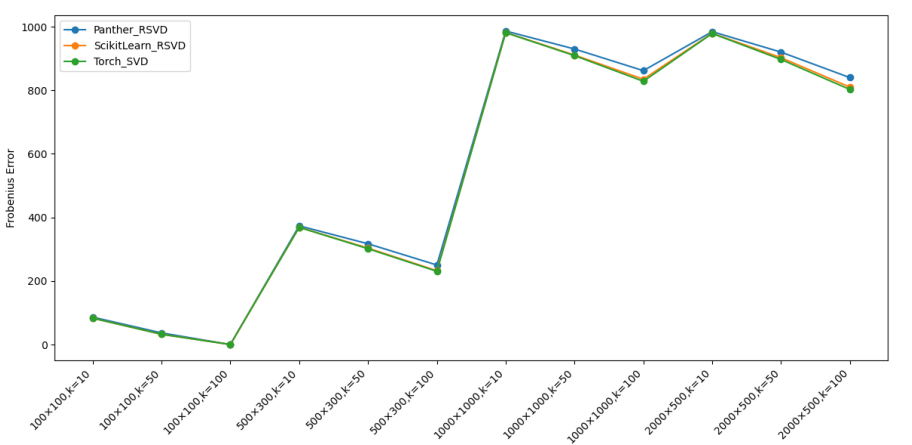

CQRRPT and Randomized SVD
=========================

These benchmarks measure the runtime, memory usage, and numerical accuracy of Panther's randomized
linear algebra primitives versus deterministic baselines.

**CQRRPT** (Cholesky QR with Randomization and Pivoting for Tall matrices) is evaluated at two
matrix heights (*m* = 8 192 and *m* = 16 768) while varying the column count *n*. The baseline
is a standard column-pivoted QR factorization.

**Randomized SVD (RSVD)** is evaluated for runtime, GPU memory, and reconstruction error relative
to the exact truncated SVD, as a function of the target rank *k*.

Units: seconds for runtime plots, GB for memory plots, relative Frobenius norm error
(``‖A − UₖSₖVₖᵀ‖_F / ‖A‖_F``) for accuracy plots. Lower is better in all cases.

----

CQRRPT runtime on m = 16 768

CQRRPT runtime on m = 8 192

CQRRPT reconstruction error on m = 8 192

CQRRPT reconstruction error on m = 16 768

RSVD runtime

RSVD memory

RSVD error

----

Key Takeaways
-------------

* **CQRRPT runtime**: Panther CQRRPT is substantially faster than pivoted QR for tall matrices
  (m ≫ n), with the gap widening as *n* grows. The randomized sketch replaces the expensive
  column-norm pass in classic QR pivoting.
* **CQRRPT accuracy**: Reconstruction error is numerically comparable to standard pivoted QR,
  confirming stability. The ``gamma`` oversampling parameter (default 1.25) controls the
  accuracy–speed trade-off; increasing it further reduces error at a small runtime cost.
* **RSVD runtime**: Panther RSVD scales nearly linearly in *k*, while exact SVD scales cubically
  in the matrix dimensions. For low-to-moderate rank targets, RSVD is the clear winner.
* **RSVD memory**: Because RSVD only computes the leading *k* components, it avoids allocating
  the full singular-value spectrum, yielding significant memory savings.
* **RSVD error**: Error decreases monotonically with *k* as expected. Use the ``tol`` parameter
  in :func:`panther.linalg.randomized_svd` to trade accuracy for speed based on your needs.
