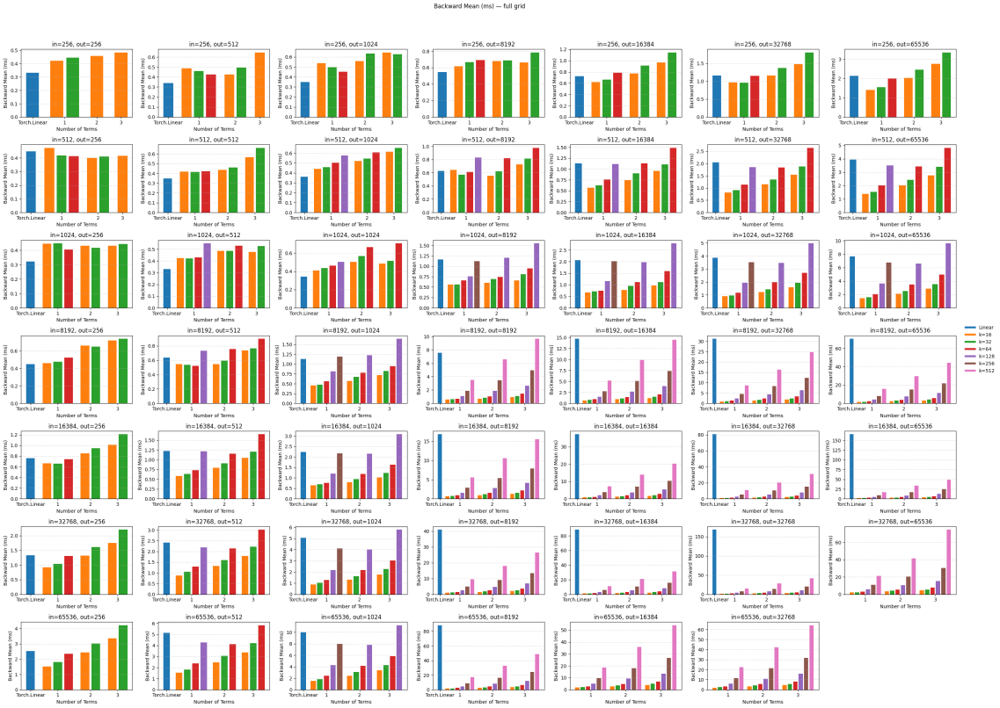
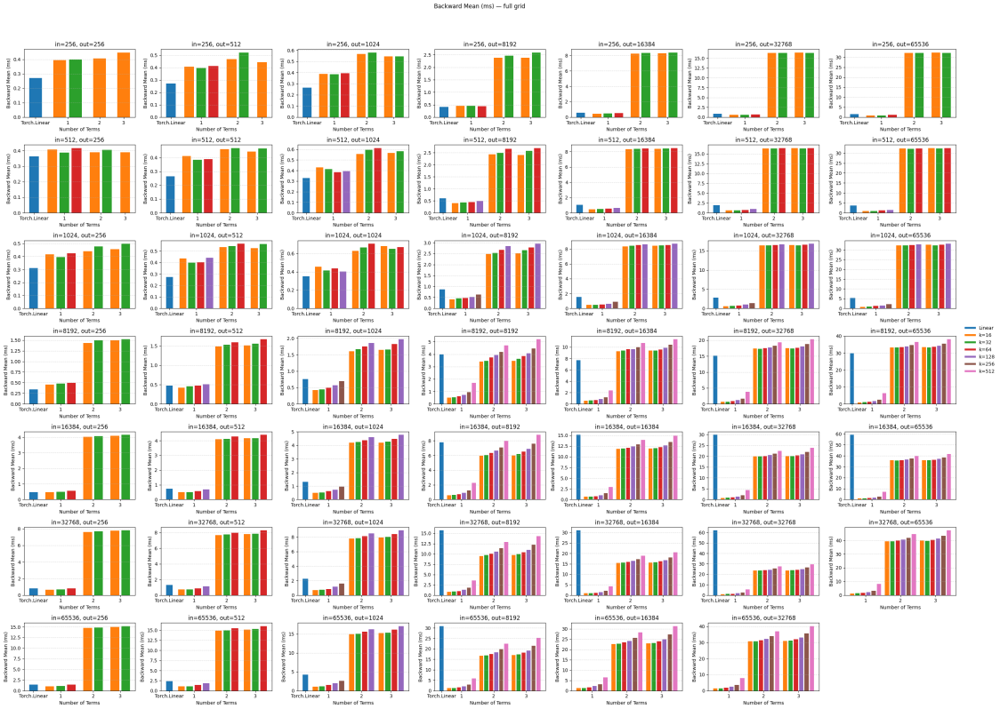
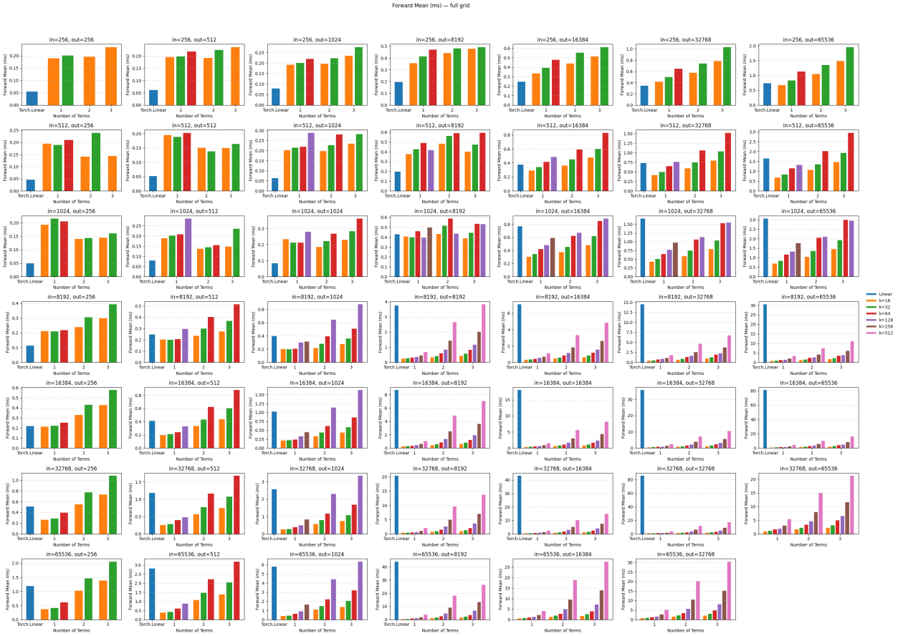
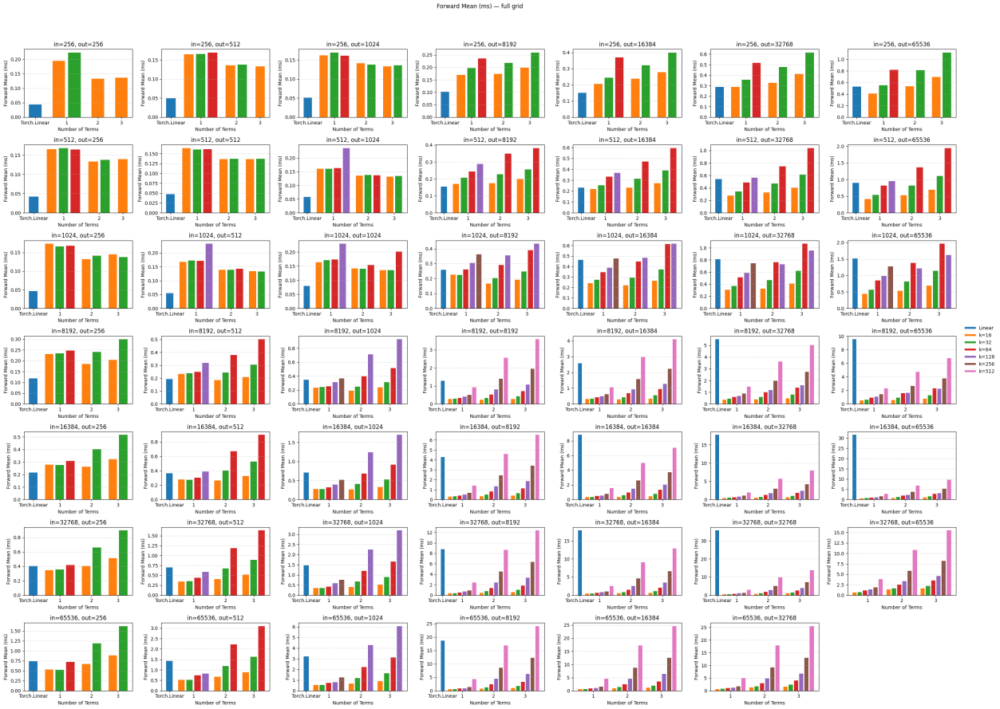

Sketched Linear Layers
======================

These benchmarks compare :class:`panther.nn.SKLinear` against the standard :class:`torch.nn.Linear` layer
for forward and backward pass wall-clock time. Experiments were run on two GPU families:

* **NVIDIA T4** — Turing architecture with Tensor Core support (FP16). Panther uses a custom Tensor
  Core kernel when ``in_features``, ``out_features``, and ``low_rank`` are all multiples of 16.
* **NVIDIA P100** — Pascal architecture without Tensor Core support, using the standard CUDA path.

The *x*-axis is the layer width (square ``in_features = out_features``). The *y*-axis is wall-clock
time in milliseconds. Lower is better.

----

Backward time for linear on NVIDIA T4 with Tensor Core implementation

Backward time for linear on NVIDIA P100 without Tensor Cores

Forward time for linear on NVIDIA T4 with Tensor Core implementation

Forward time for linear on NVIDIA P100 without Tensor Cores

----

Key Takeaways
-------------

* **Tensor Core path (T4)**: SKLinear achieves the largest speedups at wide layers where sketching
  overhead is amortized over more flops. Ensure all dimensions are multiples of 16 to activate the
  Tensor Core path (see :doc:`../api/nn`).
* **Standard CUDA path (P100)**: The advantage of SKLinear grows with layer width. For smaller
  widths, the sketching overhead can outweigh savings; SKLinear is most effective above ~4 096.
* **Backward > forward savings**: The gradient with respect to the weight in a sketched layer
  requires fewer flops than the full ``out × in`` outer product of ``nn.Linear``, so backward
  pass speedups tend to be larger.
* Use :class:`panther.tuner.SKAutoTuner` to find the optimal ``num_terms`` and ``low_rank``
  values for your specific layer shapes and target hardware.
